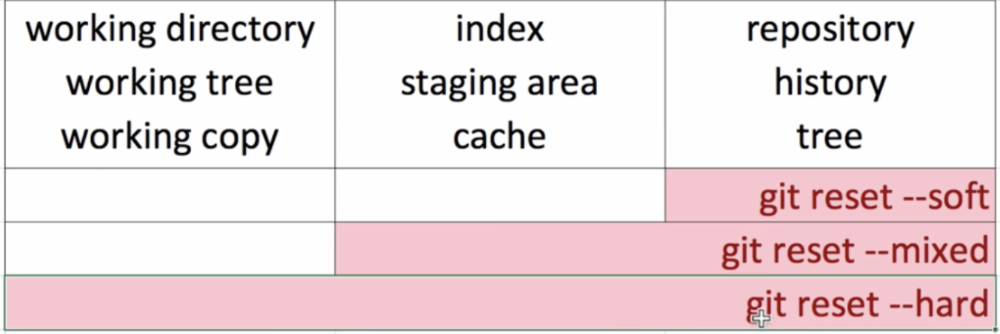

# 깃 기본 명령어
### 시작   
* git init: 디렉토리를 깃의 제어 하에 두기 위한 시작 명령어. '.git' 디렉토리가 생성되며, 그 안에 git 관련 정보들이 저장된다.   
   ---------
### 설정   
* git config —global [user.name](http://user.name) 이름   
* git config —global [user.email](http://user.email) 이메일   
   ---------
### 저장(추적?)   
* git add 파일명: git이 파일을 track하게 하기 위한 명령어. 해당 파일을 커밋 대기 상태로 만든다[staging area에 올린다]. 버전 관리에 포함하고자 하는 파일을 이 명령어를 통해 추가한다. 이 add 명령어 덕분에 한 번에 여러 작업을 해도 각각의 작업 내역을 다른 커밋으로 저장할 수 있다.      
* git commit: git 핵심 명령어. 변화local repository에 올리는 명령어. 유의미한 변화를 기록할 때 사용하는 명령어이다. 변화의 역사가 모두 기록되기 때문에 언제든지(해당 커밋을 명시적으로 삭제하지 않는 이상) 원하는 커밋으로 되돌아갈 수 있다.        
    
__git commit 옵션__   
- git commit -a(all): add를 따로 하지 않아도 변경사항을 커밋할 수 있다. [단, 버전 관리가 되고 있지 않은 파일은 한 번은 add 해줘야 함]   
- git commit -m(message): 커밋 파일을 따로 작성하지 않고, 메시지만 적어서 커밋을 한다.   
- git commit -am과 같이 두 옵션을 함께 사용할 수도 있다.   
- git commit —amend: 커밋을 수정한다.      
    -----------
### 기록 조회   
* git log: 커밋 내역을 확인한다.   
    
__git log 옵션__   
- -p: 커밋 간의 변경 사항을 보다 자세히 확인할 수 있다.   
- —branches: 브랜치 정보를 같이 확인할 수 있다.   
- —decorate: 각 브랜치 어떤 커밋을 가리키는지 확인할 수 있다.   
- —graph: 브랜치가 여러 갈래로 나뉜 것을 시각적으로 확인할 수 있다.   
- —oneline: 한눈에 보기 편하게 해준다.   
- git reflog: reset된 커밋까지 포함해서 볼 수 있다.   
   
* git diff: 현재 stage area에 올라가지 않은 파일들과 staging area에 올라간 파일들을 비교하여 보여준다. working directiory와 index의 내용을 비교 [git add하기 전에 마지막으로 점검하기 위한 커맨드]   
* git diff 커밋번호1[브랜치명1]..커밋번호2[브랜치명2]: 두 커밋[브랜치] 사이의 변화를 보여준다.   
    -----------
### **되돌리기**   
* git reset 커밋번호: 해당 커밋을 가장 최신 커밋으로 만들고, 그 이후의 커밋은 없앤다[사실은 남아있음]. 단, 원격 저장소에 반영된 내용은 건드리면 안 되고, 로컬에서의 변경사항만 되돌려야 한다.   
[커밋번호 생략 시에는 가장 최근 커밋으로 적용]   
* git reset ORIG_HEAD: 가장 최근 커밋을 되돌린다.    
   
[reset을 다시 되돌리기](https://www.youtube.com/watch?v=P-EJ-Tkb5FM&list=PLuHgQVnccGMA8iwZwrGyNXCGy2LAAsTXk&index=29)   
   
__git reset 옵션__   
—soft: respositoy까지 반영. [commit에 해당]   
—mixed: : index(staging area)까지 반영. [add에 해당]   
—hard: working directory까지 반영.   
   
   
- git revert: 커밋을 취소하면서 새로운 버전을 만드는 것.   
   ----------
__공부 자료__   
[생활코딩]지옥에서 온 Git: https://youtube.com/playlist?list=PLuHgQVnccGMA8iwZwrGyNXCGy2LAAsTXk
