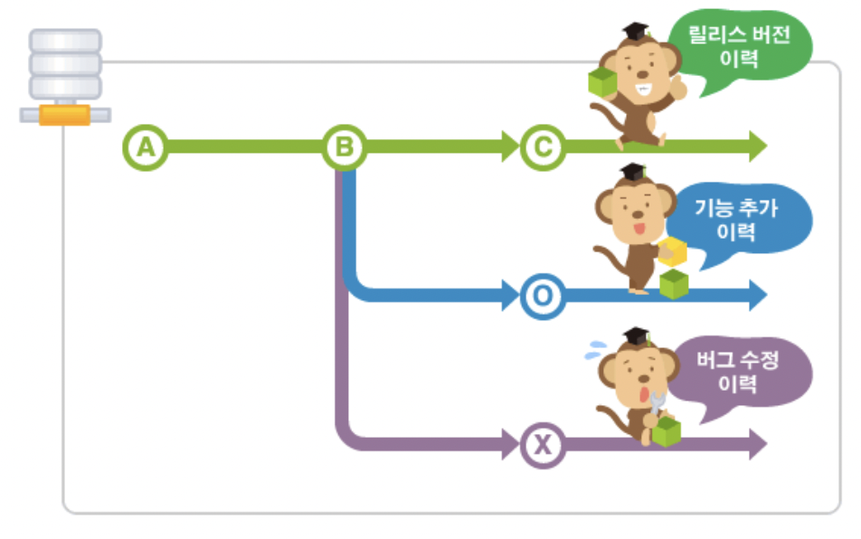
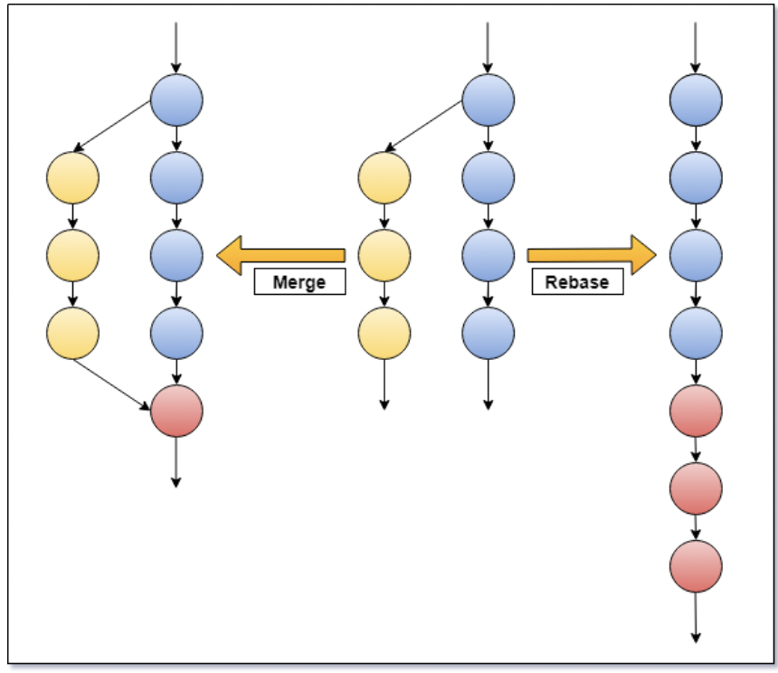

# Git Branch

나무의 가지에서 따온 말[개발에서는 root, trunk, branch 등등 식물에서 말을 많이 따옴]    
   
### 브랜치가 제공하는 편의   
1) 깔끔한 로그 관리: 하나의 기능을 제작하는 과정에서 한 번에 완성시킬 수 있는 것이 아닌 이상, commit은 많이 발생할 것이다. 그런데 그 많은 commit이 모두 메인 저장소의 log에 남는다면, 이후에 버전 관리가 아주 어려워질 것이다. 브랜치는 개발 과정에서는 commit을 많이 하다가도, 메인 저장소에는 큼직하고 유의미한 수정 사항만을 저장할 수 있게 해준다.     
2) 협업 용이: 협업하는 과정에서, 하나의 파일의 같은 부분을 두 사람이 동시에 수정하는 상황이 발생하면 충돌이 발생한다. 개발 도중 이러한 충돌이 자주 발생한다면 불편이 상당할 것이다. 하지만 브랜치를 분리하여 협업을 진행한다면 충돌을 자주 경험하지 않고 개발을 해나갈 수 있다.    
3) 용도 별 저장소 분리: 개발~완성의 과정에서 용도 별로 별도의 저장소가 필요한 경우가 있다[반드시 필요하지 않더라도 있으면 훨씬 편리할 수 있다.]. 예를 들면, Github를 이용하여 배포 자동화하는 경우가 있다. Github에 Push하면 자동으로 재배포되도록 설정해두었다면, 하나의 브랜치만으로는 충분하지 않다. 왜냐하면 변경사항마다 배포한 사이트에 반영이 된다면, commit에 에러가 포함되었을 경우, 그것이 곧바로 배포한 사이트에까지 반영되기 때문이다. 이런 상황에서 브랜치를 나누어 용도 별로 여러 개의 저장소를 마련해둔다면 많은 문제 사항이 해결된다.      
      
### 브랜치?        
 **브랜치**는 독립적으로 어떤 작업을 진행하기 위해 등장한 개념이다.    
 각각의 브랜치는 다른 브랜치의 영향을 받지 않기 때문에 동시에 여러 작업이 진행될 수 있다.    
 다양하게 만들어진 브랜치는 다른 브랜치와 병합(Merge)함으로써 작업한 내용을 다시 한 곳으로 모을 수 있다.   
 여러 명이 동시에 작업을 할 때 메인 브랜치에서 자신의 작업 전용 브랜치를 만들어 각자 작업한 후, 작업이 끝난 사람은 자신의 브랜치의 변경 사항을 메인 브랜치에 적용한다.    
 이렇게 브랜치를 이용하면, 각자가 다른 사람의 작업에 영향을 받지 않고 독립적으로 작업할 수 있으며, '작업 단위', 즉 브랜치로 그 작업의 기록을 중간중간 남기기 되므로 문제가 발생했을 때 원인이 되는 작업을 찾아내기 쉬워진다.   
     
[브랜치가 여러 개여도 각 변경 사항만 저장하기에 추가적인 저장소 사용은 크게 없다.]    
    
   
    
### 브랜치 생성 및 이동    
* git branch: 현재 생성된 브랜치 목록을 확인한다. [default는 master]   
* git branch 브랜치이름: 브랜치 생성
* git branch -d 브랜치이름: 브랜치 삭제

* git checkout 브랜치이름: 해당 브랜치로 이동한다.
* git checkout -b 브랜치이름: 브랜치 생성 후 체크아웃
* git checkout 커밋번호: 해당 커밋으로 체크아웃[해당 커밋 당시의 상세한 내용을 알아야할 때 사용]

### 병합   
* git merge 브랜치이름[병합당할브랜치]: 병합할 브랜치(메인 브랜치)로 체크아웃한 후 명령어를 실행한다.    
   
merge를 위한 툴(kdiff3): https://www.youtube.com/watch?v=0RqbZt_TZkY&list=PLuHgQVnccGMA8iwZwrGyNXCGy2LAAsTXk&index=31   
   
* git rebase 브랜치이름: base(파생된 브랜치)를 바꾼다는 의미이다. 병합될 브랜치의 가장 최근 커밋을 base로 바꾼다. merge와 마찬가지로 두 브랜치를 병합하지만, merge는 브랜치들이 병렬 상태로 유지되는 반면, rebase는 브랜치들이 수평적으로 합쳐진다. rebase는 커밋의 역사를 한 눈에 알아보기 좋다는 장점이 있지만, 위험한 측면이 있으니 사용에 유의해야 한다.    
    
    
    
### 임시 저장   
* git stash: 어떤 작업을 하던 도중 다른 브랜치에서 다른 작업을 해야 하는 상황이 온다면, 하던 작업을 버릴 수도 없고 커밋할 수도 없는 상황이 벌어진다. 그때 변경 사항[git 저장소에서 관리하고 있는 파일들만을 대상으로 함]을 어딘가에 숨겨둘 수 있게 해주는 명령어이다. 변경 사항은 저장되지만, 스테이지 상태까지는 그대로 저장되지 않는다.       
* git stash apply [stash 이름]: stash를 working directory에 불러내는 명령어이다(이름을 명시하지 않으면 가장 최근 stash 불러냄).        
* git stash drop [stash 이름]: stash를 삭제한다(이름을 명시하지 않으면 가장 최근 stash 삭제). [stash 내역은 명시적으로 삭제하기 전까지는 삭제되지 않는다.]   
* git stash pop: git stash apply와 git stash drop을 한 번에 수행하는 명령어이다.   
* git stash list: stash를 목록으로 확인한다.   
    
*stash는 '(안전한 곳에) 넣어 두다[숨기다]'라는 뜻이다.    
   
### 충돌 해결   
같은 파일일지라도 다른 부분을 수정하면 충돌이 일어나지 않는다.    
하지만 같은 파일, 그리고 같은 부분을 수정하면 충돌이 발생하여 auto-merging이 불가능하다.    
이때는 수정사항을 직접 비교하여 merge 시켜줘야 한다(stash도 마찬가지).    
     
```python
<<<<<< HEAD
function a(master) {
======
function b(exp) {
>>>>>> exp
```
충돌이 발생하면 위와 같이 '====='을 기준으로 하여 비교해서 보여준다. [파일 내용 자체가 위의 내용처럼 변한다.]     
HEAD 아래쪽은 HEAD 브랜치, 즉 현재 체크아웃한 브랜치에서의 수정 사항이고, exp 위쪽은 exp라는 브랜치에서의 수정 사항이다.      
```python
fucntion a(master, exp) {
```
위와 같이, 최종적으로 수정하고 싶은 부분만 남겨두고 저장한 후, git add 및 commit을 하면 성공적으로 merge가 된다.    
[rebase의 경우 동일한 과정을 수행하고, git rebase —continue 명령어를 실행하면 된다.]    
    
*참고로 HEAD가 가리키는 브랜치가 현재 브랜치이다.    
     
__공부 자료__
[생활코딩]지옥에서 온 Git: https://youtube.com/playlist?list=PLuHgQVnccGMA8iwZwrGyNXCGy2LAAsTXk    
[누구나 쉽게 이해할 수 있는 Git 입문]브랜치(Branch): (https://backlog.com/git-tutorial/kr/stepup/stepup1_1.html)    
[제로초]Git 브랜치(Branch) 관리: https://www.zerocho.com/category/Git/post/582342a73fbde700178771f5