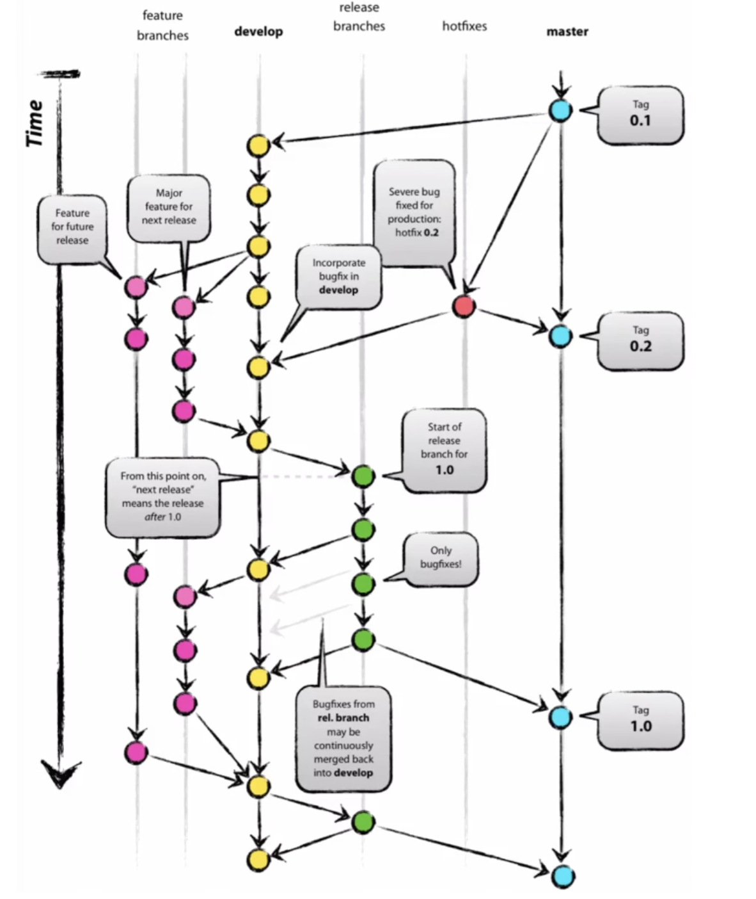

# Git Flow: 깃을 잘 사용하기 위한 한 가지 방법

깃의 커맨드를 아는 것만으로는 깃을 잘 사용한다고 할 수 없다.   
깃의 기능을 십분 활용하기 위해서는 전략이 필요하다.   
이 세상에는 많은 깃 브랜치 전략이 존재한다.    
우선 그 중 가장 대표적인 ⭐️Git Flow⭐️에 대해 기록하고자 한다.     
      
### 브랜치 종류     
1) **master:** 배포 가능한 상태만을 관리하는 브랜치. 즉, 사용자들이 이용한, 혹은 이용할 프로그램을 담고 있는 브랜치.     
2) **develop:** 개발이 이뤄지는 통합 브랜치. 각 팀원들이 작업한 내역이 합쳐지는 공간이다.    
3) **feature:** 개발 과정에서 기능 단위로 나눠지는 브랜치. 'feature/#이슈번호'와 같은 형식으로 작명된다.  하나의 기능이 완성되면 develop 브랜치로 병합된다. feature 브랜치는 보조 브랜치로, 개발자의 저장소에만 존재하며 origin에 push하지는 않는 것이 보통이다.              
4) **release:** 배포를 위한 최종 버그 수정을 수행하는 브랜치. 배포 가능한 상태가 되면, master 및 develop 브랜치로 병합한다.        
5) **hotfix:** 배포 이후 긴급 수정사항이 발생할 때 이용하는 브랜치.    
* 중심이 되는 메인 브랜치는 master와 develop이며, 필요에 따라 생성되는 feature, release, hotfix 브랜치는 병합 이후 삭제한다.    
     
### 절차    
1) **master 브랜치**로부터 **develop 브랜치**를 파생시킨다.   
2) **develop 브랜치**로부터 각 기능 별로 **feature 브랜치**를 파생시킨다(ex. feature-login).   
3) **feature 브랜치**에서 개별 기능에 대한 작업이 끝나면 그 내용을 **develop 브랜치**에 병합시킨다.   
4) 작업이 마무리되고 사용자에게 서비스를 제공하는 순간이 거의 다가오면 **develop 브랜치**로부터 **release 브랜치**를 파생시킨다.   
5) **release 브랜치**에서는 버그 수정과 관련된 작업을 수행한다. 버그를 잡으며 틈틈이 수정 사항을 **develop 브랜치**에 병합시킨다.    
6) **release 브랜치**에서 충분히 버그를 잡고 테스트까지 마쳤다면, 마침내 **master 브랜치**로 병합시킨다. 이때 **tag**를 이용하여 버전을 기록한다.    
7) 완성된 프로그램을 서버에 업로드 하거나 다운로드 받을 수 있게 하는 등, 사용자가 이용할 수 있게 한다.   
8) 사용자에게 제공한 이후의 수정 사항이 발생하면, **master 브랜치로**부터 **hotfix 브랜치**를 파생시켜 버그를 잡고, 수정 사항을 **master 브랜치**에 병합시킨 뒤 tag로 버전을 명시한다. 그 후, **develop 브랜치**에까지 병합시킨다.   
     

---
__공부 자료__    
[생활코딩]지옥에서 온 Git: https://youtube.com/playlist?list=PLuHgQVnccGMA8iwZwrGyNXCGy2LAAsTXk    
[Plus Ultra tistory]협업을 위한 Git Flow 설정하기:https://overcome-the-limits.tistory.com/entry/%ED%98%91%EC%97%85-%ED%98%91%EC%97%85%EC%9D%84-%EC%9C%84%ED%95%9C-Git-Flow-%EC%84%A4%EC%A0%95%ED%95%98%EA%B8%B0