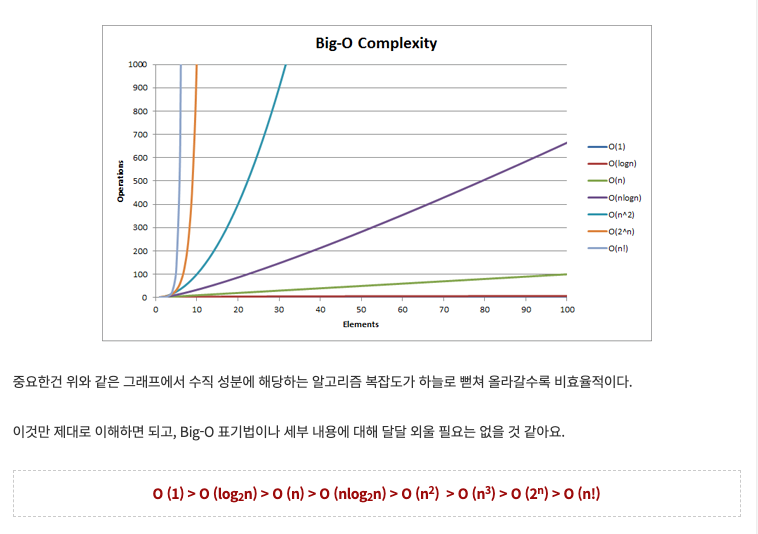

# Big-O 표기법
   
### 시간 복잡도를 어떤 식으로 간단히 표현하는 게 좋을끼?
   
Big-O는 시간 복잡도를 증가율의 관점에서 표현한다.   
증가율을 대표하는 것은 최고차항의 차수이다.   
Big-O는 최고차항을 제외한 항, 혹은 최고차항의 계수는 고려하지 않는다.   

### 예시   
2n-1, 5n+3 ... => O(n) (빅오 엔)   
4n^2+10, 12n^2+12 => O(n^2) (빅오 엔 제곱)   
   
### Big-O 정리
1) 최고차항만 남긴다.
2) 최고차항의 계수(상수)는 생략한다.
3) O(n^최고차항의 차수) 꼴로 나타낸다.
[계산 횟수가 입력 크기 n과 무관하다면, 즉 상수항만 존재한다면 O(n^0), 즉 O(1)로 표현한다.]

### Big-O 효율성 비교
