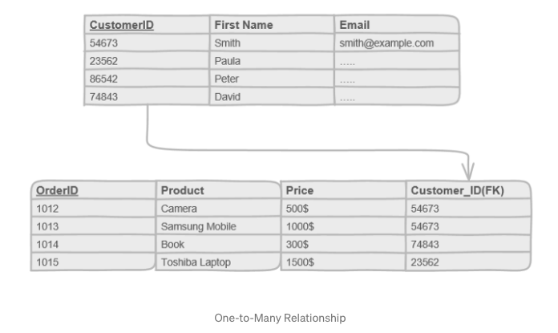
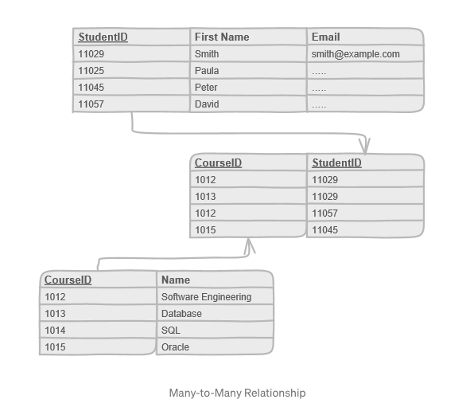

# RDB 관계 유형(Cardinality Constraints)
    
### 1. One-to-Many Relationship(일대다 관계)   
가장 일반적인 유형의 관계로, 한 테이블의 한 개의 row가 다른 한 테이블의 한 개 이상의 row와 엮인다.   
예를 들면 한 명의 작성자가 여러 글을 작성하는 하는 경우이다.   
한 명의 작성자는 여러 개의 글을 쓸 수 있지만, 하나의 글은 여러 작성자에 의해 작성될 수 없다.   
작성자와 게시글의 관계도 마찬가지이다.   
참조하는 쪽의 테이블에서는 참조되는 데이터가 여러 번 반복해서 참조될 수 있다.    
   
   
### 2. Many-to-Many Relationship(다대다 관계)   
한 테이블의 한 개 이상의 row가 다른 한 테이블의 한 개 이상의 row와 엮인다.   
예를 들면, 여러 학생이 여러 수업에 등록하는 경우이다.   
한 명의 학생은 하나 이상의 수업을 들을 수 있으며, 하나의 수업은 한 명 이상의 학생을 포함할 수 있다.   
소비자가 상품을 장바구니에 담는 경우도 이러한 관계에 해당한다.   
그런데, 하나의 row(데이터)가 특정 column에서 여러 항목을 참조할 수는 없다.    
따라서 junction(or linking) table이라 불리는 새로운 테이블을 만들어 관계를 형성한다.   
두 개의 테이블을 각각 다른 column으로서 참조하는, 오직 둘의 관계를 나타내는 용도로만 쓰이는 테이블을 만드는 것이다.   
   
    
실무에서는 이와 같은 다대다 관계를 사용하지 않는 것이 좋다.   
왜냐하면 서비스가 확장함에 따라, 혹은 기능이 추가됨에 따라 junction table 자체에 주문시간 혹은 수량과 같은 추가적인 데이터가 들어가야 할 필요성이 생길 수 있기 때문이다.   
junction table은 오직 서로 다른 두 테이블의 데이터를 mapping 해주는 역할만 하기에 적합하지 않다.   
따라서 다대다 관계를 나타낼 때에는, 별도의 연결용 엔티티를 생성하여 junction table을 엔티티로 승격시키는 것이 좋다.   
   
### 3. One-to-One Relationship(일대일 관계)   
한 테이블의 한 개의 row가 다른 한 테이블의 한 개의 row와 엮인다.   
이와 같은 관계는 간혹가다 존재하긴 하지만, 흔히 쓰이지는 않는다.   
왜냐하면 한 개의 데이터에 한 개의 데이터가 mapping 되는 것이면, 그냥 둘을 하나로 합치면 되기 때문이다.   
   
이와 같이 몇대몇 관계인지 나타내는 Cardinality Contraints 외에도, 하나 이상의 participantion이 있어야 하는지 아닌지(django로 치면, null=True인지 아닌지)에 따라 구분짓는 Existence Dependency Constraints도 있다.   
   
- - -
__공부 자료__   
Database - Fundamentals: https://medium.com/omarelgabrys-blog/database-fundamentals-part-2-b841032243ac   
다대다 관계: https://ict-nroo.tistory.com/127   
